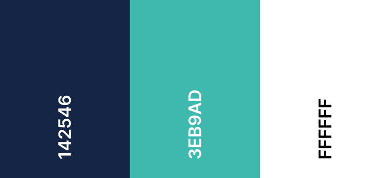

[View website here](https://tony-reddington.github.io/mayan-riviera-travel-1/)

# Mayan Riviera Travel website

## The goal of this website is to showcase information about tour availability in the Mayan Riviera coastal region and surrounding areas. It will provide the customers with reliable transport from their hotels, knowledgeable tour guides, good value for money and give the user a full sense of security whilst travelling.

## UX

### User Goals
* Check tour availability
* Identify how much time needed for each tour option to determine which tour to choose.
* Check the price of the trips
* Contact the company to check if there is availability for the people travelling.
* Contact the company to ask for additional tour information.
* Ensuring security is of vital importance to the company, so the travellers are safe.
* Checking collection times
 
### User Stories
* As a user, I want all the tours laid out neatly so I can navigate easily through the options to make my final decision.
* As a user, I want to know how much time each tour will take.
* As a user, I want to know the final price per person includes taxes, and there are no additional charges later when I make payment.
* As a user, I want to be able to contact the company to check availability and ask further information about tours.
* As a user, I want to feel secure when booking and ensure my travel partners are safe when travelling.
 
### Site Owner Goals
* As a site owner, I want to provide users with the best available tours at the lowest prices.
* Emphasize how experienced our tour guides are.
* I want users to feel secure when travelling with the company.
* I want to communicate how long each tour will take.
* I want to convey that all costs include taxes with no additional surprise fees.
* I want to express that users will be transported in new vehicles with seat belts and experienced drivers.
* I want to give speedy responses to all enquiries.

### Design

#### Colour Scheme
- The main colours i used for this website are Space Cadet #142546/ Light Sea Green #3Eb9ad and White.

#### Typography

- Lato google font was used throughout the website with San Serif being the fall back font. I used the Lato font in a previous project and felt it was clear and not too fancy to be legible.

#### Imagery

- Images are one of the main focuses of this website. The first images that users will see on the home page is the image carousel that will draw people in to see what's being offered.

#### Wireframes

* [Home wireframe](documents/home-wireframe.pdf)

* [Tours wireframe](documents/tours-wireframe.pdf)

* [Contact Us wireframe](documents/Contact-us-wireframe.pdf)

## Features

### Existing Features
* The website is made made up of three pages that are linked using the Navbar
* The main navigation bar across the 3 x pages allows the user to select what page the want to view.
* The top scrolling Carousel on the main page allows users to see the locations on offer with identifying captions and text giving some information.
* The footer gives users contact information aswell as social media links where they can view further company info.
* The carousel features again for all tours that have more than one location showing the user what's being offered.
* Further section tour duration navbar is located on the tour page to save the user scrolling.
* Form on contact page allows the user to make contact and gather more information.

### Features for future implimentation
* Book button that links to payment page
* Review section

## Technology Used

### Languages used
* HTML5
* CSS3

### Frameworks/Libraries and Programs used
1. [Balsamiq](https://balsamiq.com/)
    - Balsamic was used to create wireframes when designing the website.
2. [Font Awesome](https://fontawesome.com/)
    - Font awesome was used for the social media icons in the footer.
3. [Google fonts](https://fonts.google.com/)
    - The lato font that i used across the website was taken from Google fonts.
4. [Istockphoto](https://www.istockphoto.com/)
    - Istockphoto was used for all the website images.
5. [TinyPNG](https://tinypng.com/)
    - Tinypng was used to reduce the size of all the website images.
6. [Befunky photo editor](https://www.befunky.com/)
    - Befunky photo editor online application was used to crop and resize images.
7. [Bootstrap](https://getbootstrap.com/)
    - Bootstrap was used to make my website more responsive across different size devices plus the Navbar and Carousels.
8. [Jquery/Popper bundle](https://getbootstrap.com/docs/4.5/getting-started/introduction/)
    - Jquery/Popper bundle was used to make the image carousel active on the Home page and Tour page.
9. [Git](https://git-scm.com/)
    - This was used for version control through Gitpod.
10. [Gitpod](https://gitpod.io/)
    - Gitpod was used to build this website.
11. [Github](https://github.com/)
    - Github was used to store the images/documents and website code.
12. [Google Devtools](https://developers.google.com/web/tools/chrome-devtools)
    - This was used throughout the project to check responsiveness across different devices and lighthouse was used to analyse the performance/best practices and accesibility and allowed me to make changes whre required.
13. [Webformatter](https://webformatter.com/)
    - This was used to reformat html and CSS code to make so all code was neat and formatted correctly.

## Testing

## Deployment

### Github Pages

## Credits

### Code
* Bootstrap was used for the Navbars/Carousels and to make the page responsive across different size devices.
* [W3 Schools](https://www.w3schools.com/) was used to refresh my memory regarding how some code should be used and how it should work.

### Content
* All text within the website was written by the developer.

### Media
* All images were downloaded from [Istock](https://www.istockphoto.com/) with special credit to Swissmediavision/Diegocardini/Christopher Heil/Sorincolac/Simon Dannhauer/chechele/jlazouphoto/LUNAMARINA/Esdelval/OGphoto/CampPhoto/DC_Colombia & Mlenny
* [Hatchful](https://hatchful.shopify.com/) was used to create the company logo.

### Acknowledgements
* My mentor who gave great pointers/feedback and support.
* The Slack community for building up an amazing library of issue resolutions.
